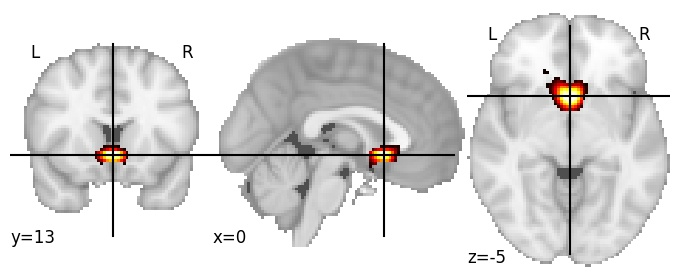

| **Subcallosal cortex** identified on various resolutions |

| 1024 resolution, the component index number is 716|  
|:---:|  
|  |

| 1024 resolution, the component index number is 716|  
|:---:|  
|  |