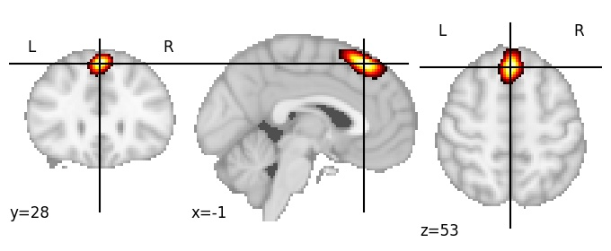
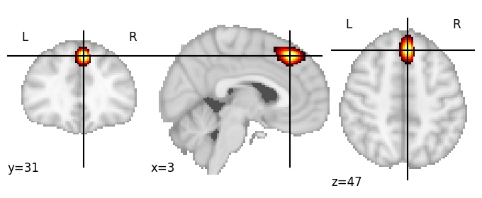

| **Superior frontal gyrus medial middle** identified on various resolutions |

| 512 resolution, the component index number is 298|  
|:---:|  
|  |

| 1024 resolution, the component index number is 547|  
|:---:|  
|  |