# **Superior frontal sulcus**

| 64 resolution, the component index number is 0|  
|:---:|  
| 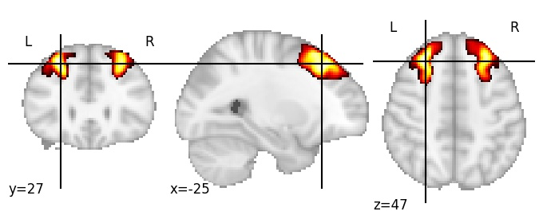 |

| 128 resolution, the component index number is 8|  
|:---:|  
| 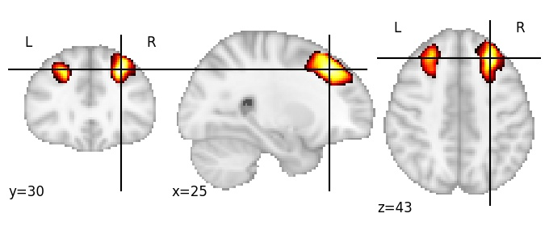 |

# **All children of Superior frontal sulcus**

## Right Hemisphere (RH)

| 256 resolution, the component index number is 247|  
|:---|  
|  |

| 1024 resolution, the component index number is 338|  
|:---|  
| 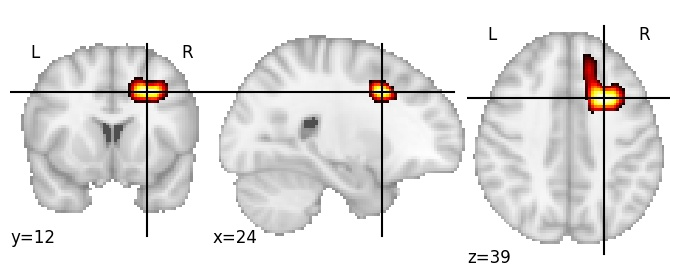 |

## Left Hemisphere (LH)

| 256 resolution, the component index number is 44|
|:---|
|  |

## Anterior

| 128 resolution, the component index number is 89|  
|:---|  
| 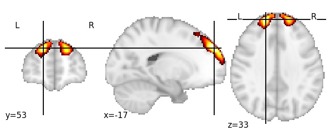 |

## Middle LH

| 512 resolution, the component index number is 123|  
|:---|  
| 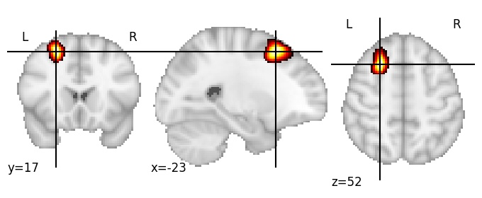 |

| 1024 resolution, the component index number is 62|  
|:---|  
| 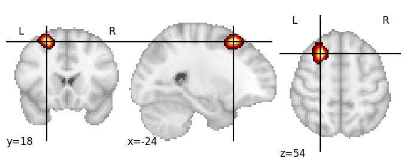 |

## Anterior LH

| 128 resolution, the component index number is 100|  
|:---:|  
| 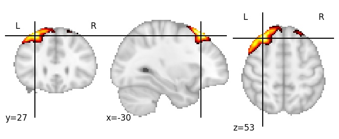 |

| 512 resolution, the component index number is 184|  
|:---|  
| 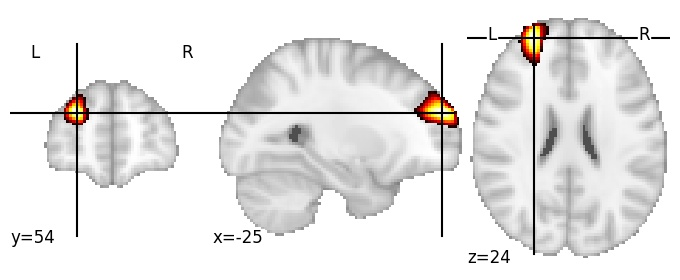 |

| 1024 resolution, the component index number is 855|  
|:---|  
| 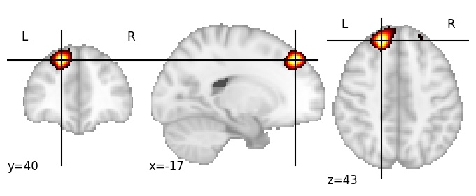 |

## Anterior RH

| 256 resolution, the component index number is 53|  
|:---:|  
|  |

| 512 resolution, the component index number is 31|  
|:---:|  
|  |

| 1024 resolution, the component index number is 10|  
|:---:|  
| 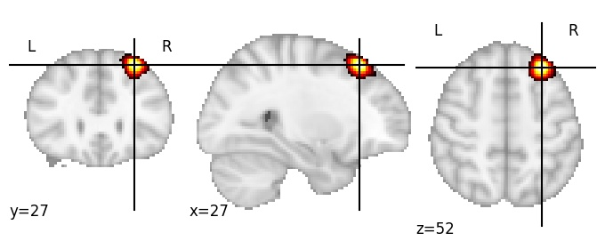 |

## Middle

| 512 resolution, the component index number is 306|  
|:---:|  
| 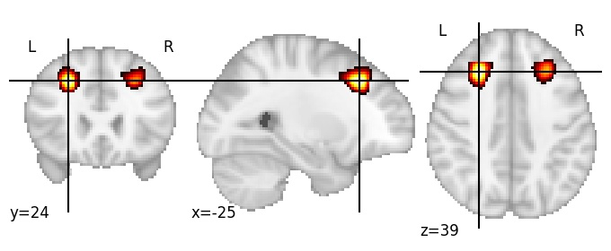 |

| 1024 resolution, the component index number is 746|  
|:---:|  
| 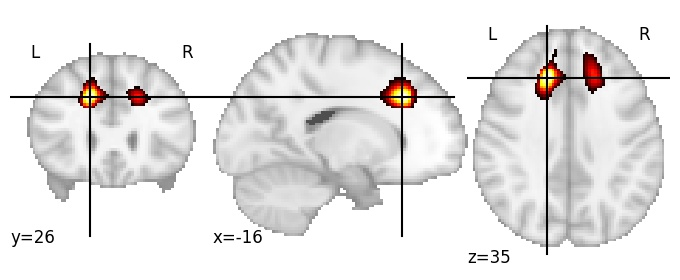 |

## Middle RH

| 1024 resolution, the component index number is 206|  
|:---:|  
| 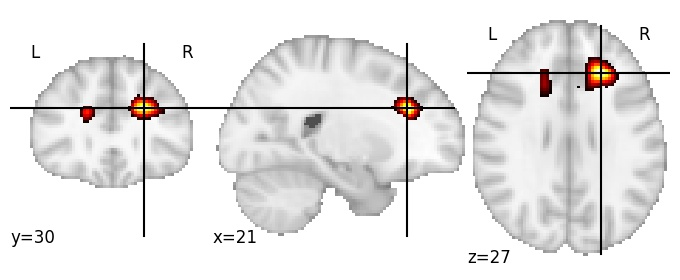 |

## Posterior

| 1024 resolution, the component index number is 124|  
|:---:|  
| 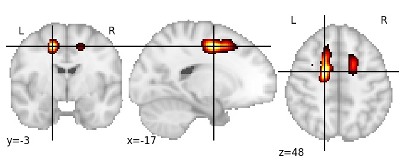 |

## Posterior LH

| 1024 resolution, the component index number is 47|  
|:---:|  
| 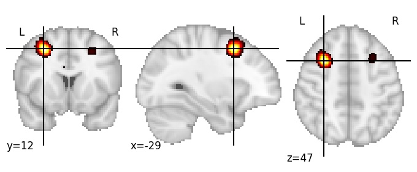 |

## Posterior RH

| 512 resolution, the component index number is 499|  
|:---:|  
| 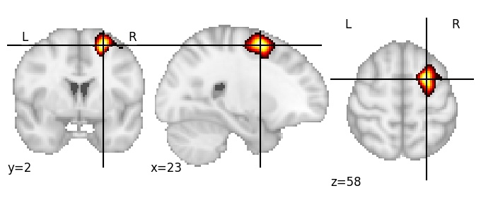 |

| 1024 resolution, the component index number is 336|  
|:---:|  
| 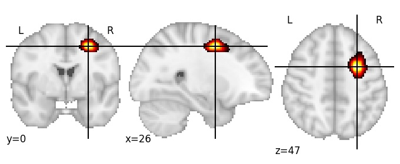 |

## Mid-posterior LH

| 1024 resolution, the component index number is 882|  
|:---:|  
| 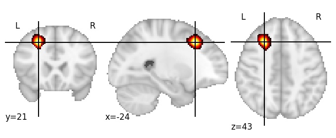 |

## Mid-posterior RH

| 512 resolution, the component index number is 276|  
|:---:|  
| 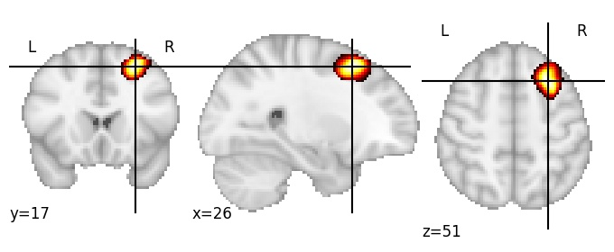 |

| 1024 resolution, the component index number is 1014|  
|:---:|  
| 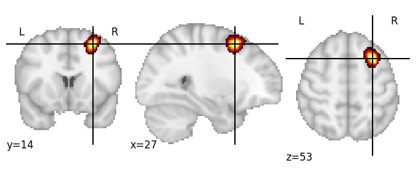 |
