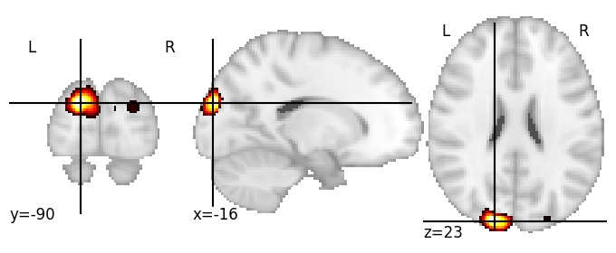
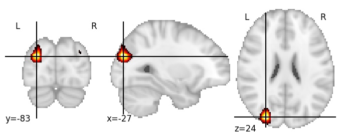

| **Superior occipital gyrus LH** identified on various resolutions |

| 512 resolution, the component index number is 149|  
|:---:|  
|  |

| 512 resolution, the component index number is 149|  
|:---:|  
|  |

| 1024 resolution, the component index number is 337|  
|:---:|  
|  |

| 1024 resolution, the component index number is 337|  
|:---:|  
|  |

| 1024 resolution, the component index number is 337|  
|:---:|  
|  |