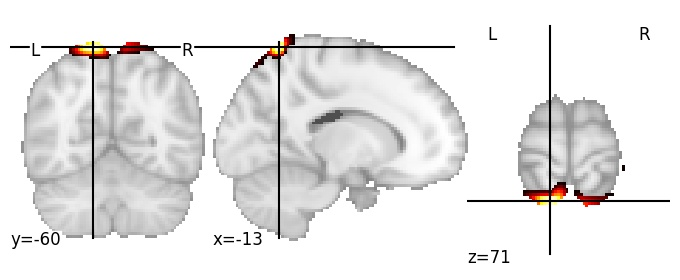

| **Superior parietal lobule superior** identified on various resolutions |

| 256 resolution, the component index number is 207|  
|:---:|  
|  |

| 1024 resolution, the component index number is 328|  
|:---:|  
|  |