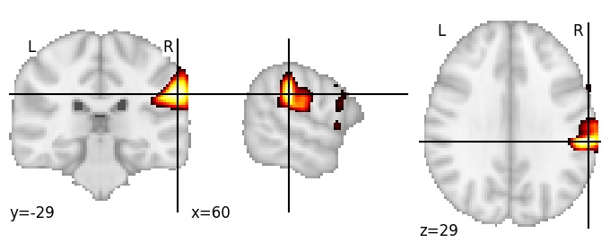

| **Supramarginal gyrus anterior, RH** identified on various resolutions |

| 128 resolution, the component index number is 113|  
|:---:|  
|  |

| 256 resolution, the component index number is 46|  
|:---:|  
|  |