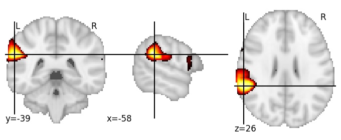
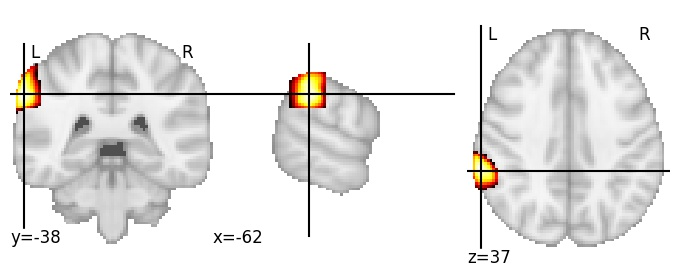

| **Supramarginal gyrus, LH** identified on various resolutions |

| 128 resolution, the component index number is 36|  
|:---:|  
|  |

| 256 resolution, the component index number is 21|  
|:---:|  
|  |