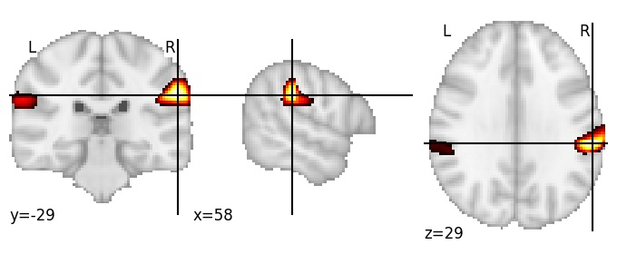

| **Supramarginal gyrus** identified on various resolutions |

| 64 resolution, the component index number is 36|  
|:---:|  
|  |

| 256 resolution, the component index number is 72|  
|:---:|  
|  |