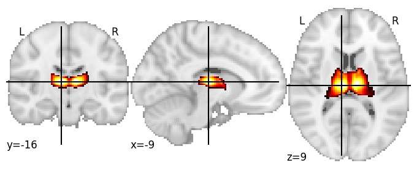

| **Thalamus** identified on various resolutions |

| 64 resolution, the component index number is 46|  
|:---:|  
|  |

| 128 resolution, the component index number is 70|  
|:---:|  
|  |

| 256 resolution, the component index number is 40|  
|:---:|  
|  |

| 256 resolution, the component index number is 40|  
|:---:|  
|  |

| 256 resolution, the component index number is 40|  
|:---:|  
|  |

| 256 resolution, the component index number is 40|  
|:---:|  
|  |

| 1024 resolution, the component index number is 280|  
|:---:|  
|  |