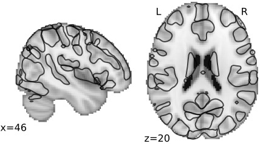
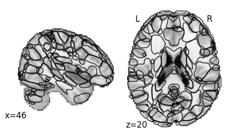

# Dictionaries of multiple dimensions

See regions for: [64 dimensions](64 "Labels for 64 dimensions") &nbsp;&nbsp;&nbsp;&nbsp;&nbsp;[Download](https://osf.io/6fjqa/download)

See regions for: [128 dimensions](128 "Labels for 128 dimensions") &nbsp;&nbsp;&nbsp;&nbsp;&nbsp;[Download](https://osf.io/zw6ua/download)

See regions for: [256 dimensions](256 "Labels for 256 dimensions") &nbsp;&nbsp;&nbsp;&nbsp;&nbsp;[Download](https://osf.io/tku4r/download)

See regions for: [512 dimensions](512 "Labels for 512 dimensions") &nbsp;&nbsp;&nbsp;&nbsp;&nbsp;[Download](https://osf.io/2hsjk/download)

See regions for: [1024 dimensions](1024 "Labels for 1024 dimensions") &nbsp;&nbsp;&nbsp;&nbsp;&nbsp;[Download](https://osf.io/wa894/download)